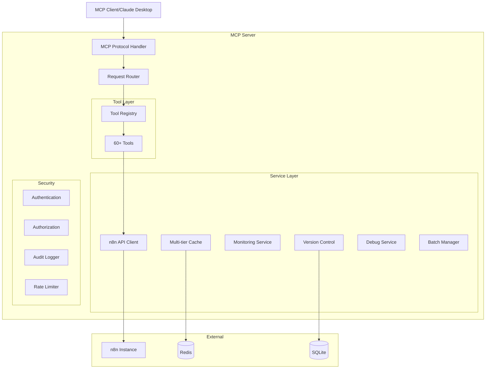
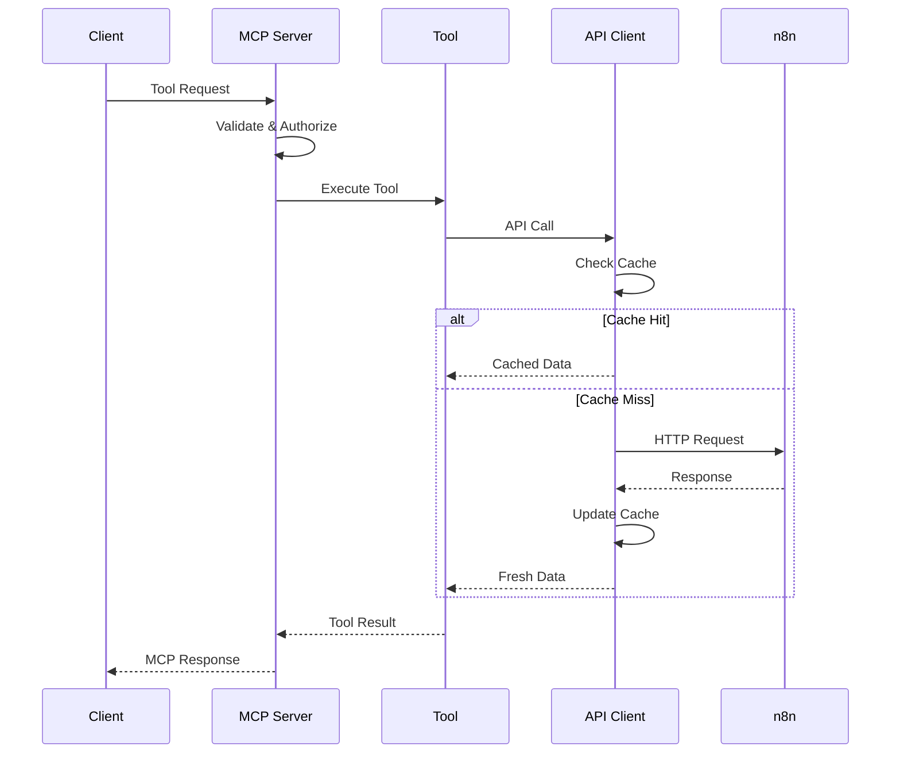
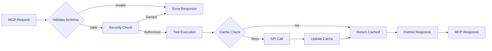
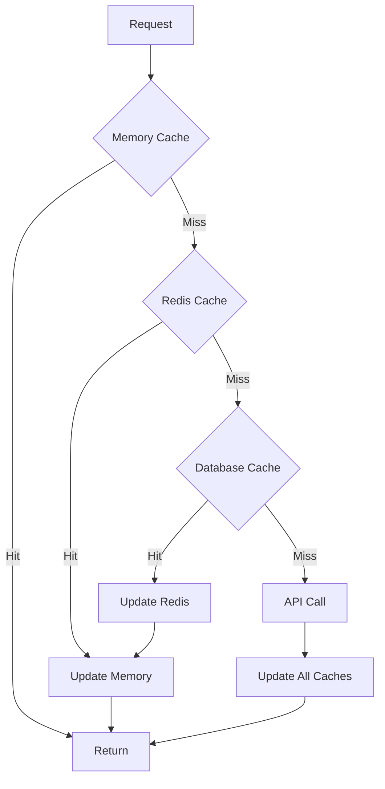
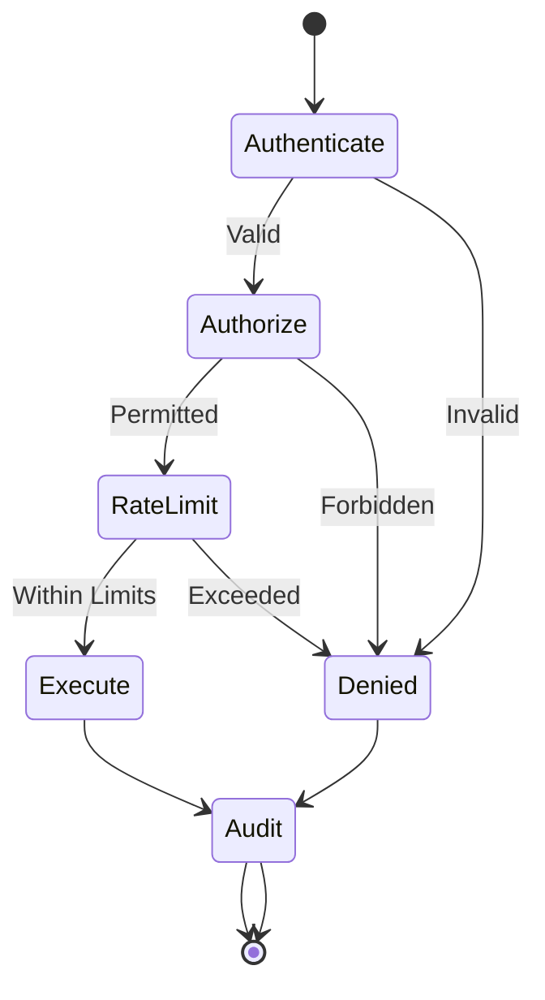
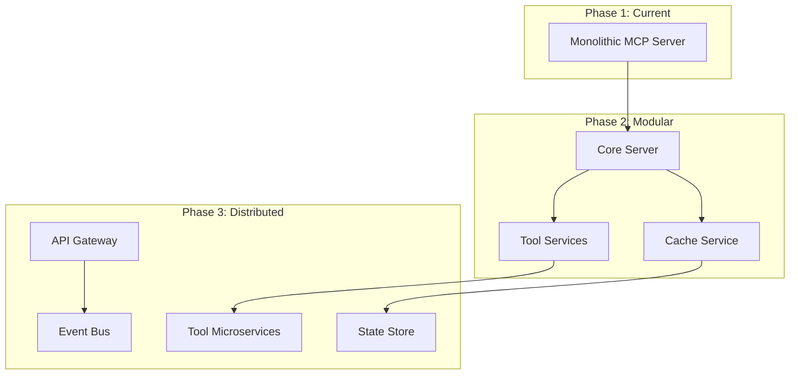

# n8n MCP Server Architecture

This document describes the architecture, design decisions, and implementation patterns of the n8n MCP Server.

## Table of Contents

1. [Overview](#overview)
2. [Architecture Principles](#architecture-principles)
3. [System Architecture](#system-architecture)
4. [Core Components](#core-components)
5. [Design Patterns](#design-patterns)
6. [Data Flow](#data-flow)
7. [Security Architecture](#security-architecture)
8. [Performance Considerations](#performance-considerations)
9. [Extension Points](#extension-points)
10. [Future Architecture](#future-architecture)

## Overview

The n8n MCP Server is built as a comprehensive Model Context Protocol server that provides full access to n8n's workflow automation capabilities. It follows a modular, extensible architecture designed for reliability, performance, and developer experience.

### Key Architectural Goals

1. **Modularity**: Clear separation of concerns with pluggable components
2. **Extensibility**: Easy to add new tools and features
3. **Performance**: Multi-tier caching and efficient resource usage
4. **Security**: Defense-in-depth with multiple security layers
5. **Reliability**: Comprehensive error handling and recovery
6. **Developer Experience**: Type-safe, well-documented APIs

## Architecture Principles

### 1. Layered Architecture

```
┌─────────────────────────────────────────┐
│          MCP Protocol Layer             │  External Interface
├─────────────────────────────────────────┤
│            Tool Layer                   │  Business Logic
├─────────────────────────────────────────┤
│          Service Layer                  │  Core Services
├─────────────────────────────────────────┤
│        Integration Layer                │  External APIs
├─────────────────────────────────────────┤
│         Storage Layer                   │  Persistence
└─────────────────────────────────────────┘
```

### 2. Dependency Injection

All major components use dependency injection for:
- Testability
- Loose coupling
- Configuration flexibility
- Runtime composition

### 3. Interface-First Design

Every major component has an interface:
```typescript
interface IToolRegistry {
  register(tool: ITool): void;
  get(name: string): ITool;
  list(): ITool[];
}
```

### 4. Fail-Safe Defaults

Components provide sensible defaults and graceful degradation:
- Cache misses fall through to API
- WebSocket failures fall back to polling
- Security defaults to deny

## System Architecture

### High-Level Architecture



### Component Interaction



## Core Components

### 1. N8nMcpServer

The main server class that orchestrates all components:

```typescript
class N8nMcpServer {
  private server: Server;
  private toolRegistry: ToolRegistry;
  private apiClient: N8nApiClient;
  private securityManager: SecurityManager;
  private monitoringService?: RealtimeMonitoringService;
  
  async connect(transport: Transport): Promise<void> {
    // Initialize components
    // Register tools
    // Set up handlers
  }
}
```

**Responsibilities:**
- Server lifecycle management
- Component initialization
- Request routing
- Error handling

### 2. Tool System

#### Base Tool Class

```typescript
abstract class BaseTool implements ITool {
  abstract name: string;
  abstract description: string;
  abstract inputSchema: z.ZodSchema;
  
  async execute(params: unknown, context: IToolContext): Promise<IToolResponse> {
    const input = this.validateInput(params);
    return this.executeInternal(input, context);
  }
  
  protected abstract executeInternal(input: T, context: IToolContext): Promise<IToolResponse>;
}
```

#### Tool Registry

```typescript
class ToolRegistry {
  private tools: Map<string, ITool> = new Map();
  private categories: Map<string, Set<string>> = new Map();
  
  register(tool: ITool, options?: IToolRegistrationOptions): void {
    this.tools.set(tool.name, tool);
    this.categorize(tool);
    this.emit('tool:registered', tool);
  }
}
```

### 3. API Client

Multi-layered API client with caching and queuing:

```typescript
class N8nApiClient {
  constructor(
    private config: N8nApiConfig,
    private cache?: MultiTierCacheManager,
    private queue?: RequestQueue
  ) {}
  
  async request<T>(method: string, path: string, options?: ApiRequestOptions): Promise<T> {
    // Check cache
    // Queue if needed
    // Make request
    // Handle errors
    // Update cache
  }
}
```

### 4. Service Layer

#### Version Control Service

```typescript
class VersionControlService {
  private storage: IVersionStorage;
  private differ: WorkflowDiffer;
  
  async createVersion(workflow: Workflow, message: string): Promise<WorkflowVersion> {
    const version = SemanticVersioning.getNextVersion(currentVersion, changeType);
    const changes = this.differ.diff(previousWorkflow, workflow);
    return this.storage.saveVersion(workflow, version, changes, message);
  }
}
```

#### Monitoring Service

```typescript
class RealtimeMonitoringService {
  private protocol: MonitoringProtocol;
  private subscribers: Map<string, Set<(data: any) => void>>;
  
  async connect(): Promise<void> {
    switch (this.protocol) {
      case 'websocket': return this.connectWebSocket();
      case 'sse': return this.connectSSE();
      case 'polling': return this.startPolling();
    }
  }
}
```

### 5. Security Layer

#### Security Manager

```typescript
class SecurityManager {
  constructor(
    private config: ISecurityConfig,
    private apiKeyManager: ApiKeyManager,
    private authorization: Authorization,
    private auditLogger: AuditLogger,
    private rateLimiter: RateLimiter
  ) {}
  
  async checkToolSecurity(toolName: string, context: ISecurityContext): Promise<void> {
    await this.authenticate(context);
    await this.authorize(toolName, context);
    await this.checkRateLimit(context);
    this.audit(toolName, context);
  }
}
```

## Design Patterns

### 1. Strategy Pattern

Used for pluggable implementations:

```typescript
interface ICacheLayer {
  get(key: string): Promise<any>;
  set(key: string, value: any, ttl?: number): Promise<void>;
}

class MemoryCacheLayer implements ICacheLayer { }
class RedisCacheLayer implements ICacheLayer { }
class DatabaseCacheLayer implements ICacheLayer { }
```

### 2. Chain of Responsibility

Used in multi-tier caching:

```typescript
class MultiTierCacheManager {
  private layers: ICacheLayer[] = [];
  
  async get(key: string): Promise<any> {
    for (const layer of this.layers) {
      const value = await layer.get(key);
      if (value !== undefined) {
        // Populate higher layers
        return value;
      }
    }
    return undefined;
  }
}
```

### 3. Observer Pattern

Used for event-driven updates:

```typescript
class ToolRegistry extends EventEmitter {
  register(tool: ITool): void {
    // Registration logic
    this.emit('tool:registered', tool);
  }
}
```

### 4. Factory Pattern

Used for creating specialized components:

```typescript
class MonitoringProtocolFactory {
  static create(protocol: MonitoringProtocol, options: IMonitoringOptions): IMonitoringService {
    switch (protocol) {
      case 'websocket': return new WebSocketService(options);
      case 'sse': return new SSEService(options);
      case 'polling': return new PollingService(options);
    }
  }
}
```

### 5. Decorator Pattern

Used for adding functionality:

```typescript
class CachedApiClient extends N8nApiClient {
  async request<T>(...args): Promise<T> {
    const cacheKey = this.getCacheKey(args);
    const cached = await this.cache.get(cacheKey);
    if (cached) return cached;
    
    const result = await super.request<T>(...args);
    await this.cache.set(cacheKey, result);
    return result;
  }
}
```

## Data Flow

### Request Processing Flow



### Caching Flow



## Security Architecture

### Defense in Depth

```
Layer 1: Transport Security (TLS)
Layer 2: Authentication (API Keys)
Layer 3: Authorization (RBAC)
Layer 4: Rate Limiting
Layer 5: Input Validation
Layer 6: Audit Logging
```

### Security Flow



## Performance Considerations

### 1. Caching Strategy

**Multi-Tier Cache:**
- L1: In-memory LRU cache (µs latency)
- L2: Redis distributed cache (ms latency)
- L3: SQLite persistent cache (10ms latency)

**Cache Key Design:**
```typescript
const key = `${resource}:${id}:${version}:${hash(params)}`;
```

### 2. Connection Pooling

```typescript
class ConnectionPool {
  private idle: Connection[] = [];
  private active: Map<string, Connection> = new Map();
  private maxConnections = 10;
  
  async acquire(): Promise<Connection> {
    if (this.idle.length > 0) {
      return this.idle.pop()!;
    }
    if (this.active.size < this.maxConnections) {
      return this.createConnection();
    }
    return this.waitForConnection();
  }
}
```

### 3. Request Batching

```typescript
class BatchManager {
  private queue: Map<string, Request[]> = new Map();
  private timer?: NodeJS.Timeout;
  
  async add(request: Request): Promise<Response> {
    this.queue.get(request.type)?.push(request) || 
    this.queue.set(request.type, [request]);
    
    if (!this.timer) {
      this.timer = setTimeout(() => this.flush(), 50);
    }
    
    return request.promise;
  }
}
```

### 4. Resource Optimization

- Lazy loading of tools
- Streaming for large responses
- Pagination for list operations
- Selective field retrieval

## Extension Points

### 1. Custom Tools

```typescript
export class CustomTool extends BaseTool {
  name = 'custom_tool';
  description = 'My custom tool';
  inputSchema = z.object({ /* schema */ });
  
  async executeInternal(input: Input, context: IToolContext) {
    // Implementation
  }
}

// Register
server.registerTool(new CustomTool());
```

### 2. Custom Cache Layers

```typescript
class S3CacheLayer implements ICacheLayer {
  async get(key: string): Promise<any> {
    // S3 implementation
  }
  
  async set(key: string, value: any, ttl?: number): Promise<void> {
    // S3 implementation
  }
}
```

### 3. Custom Security Providers

```typescript
class OAuthSecurityProvider implements ISecurityProvider {
  async authenticate(context: ISecurityContext): Promise<IUser> {
    // OAuth implementation
  }
}
```

### 4. Plugin System (Future)

```typescript
interface IPlugin {
  name: string;
  version: string;
  init(server: N8nMcpServer): Promise<void>;
  tools?: ITool[];
  services?: IService[];
  middleware?: IMiddleware[];
}
```

## Future Architecture

### Planned Enhancements

1. **Microservices Architecture**
   - Separate tool services
   - Independent scaling
   - Service mesh integration

2. **Event-Driven Architecture**
   - Event sourcing for workflows
   - CQRS for read/write separation
   - Saga pattern for transactions

3. **AI Integration**
   - ML-based workflow optimization
   - Predictive error detection
   - Natural language processing

4. **Advanced Monitoring**
   - Distributed tracing
   - Performance profiling
   - Anomaly detection

### Scalability Roadmap



## Best Practices

### 1. Error Handling

```typescript
try {
  return await operation();
} catch (error) {
  if (isRetryable(error)) {
    return await this.retryWithBackoff(operation);
  }
  throw new ContextualError(error, context);
}
```

### 2. Logging

```typescript
logger.info('Tool execution started', {
  tool: toolName,
  user: context.user,
  params: sanitize(params)
});
```

### 3. Testing

- Unit tests for individual components
- Integration tests for service interactions
- E2E tests for complete workflows
- Performance benchmarks

### 4. Documentation

- TSDoc for all public APIs
- Architecture decision records (ADRs)
- Runbooks for operations
- API examples

## Conclusion

The n8n MCP Server architecture prioritizes:
- **Modularity** for maintainability
- **Performance** through intelligent caching
- **Security** with defense-in-depth
- **Extensibility** via clear interfaces
- **Reliability** through comprehensive error handling

This architecture supports both current requirements and future growth, providing a solid foundation for enterprise-grade workflow automation.